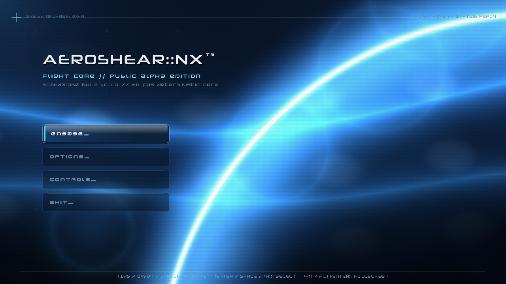
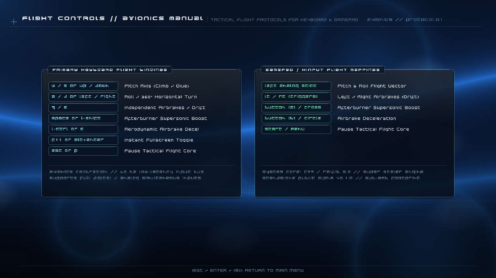
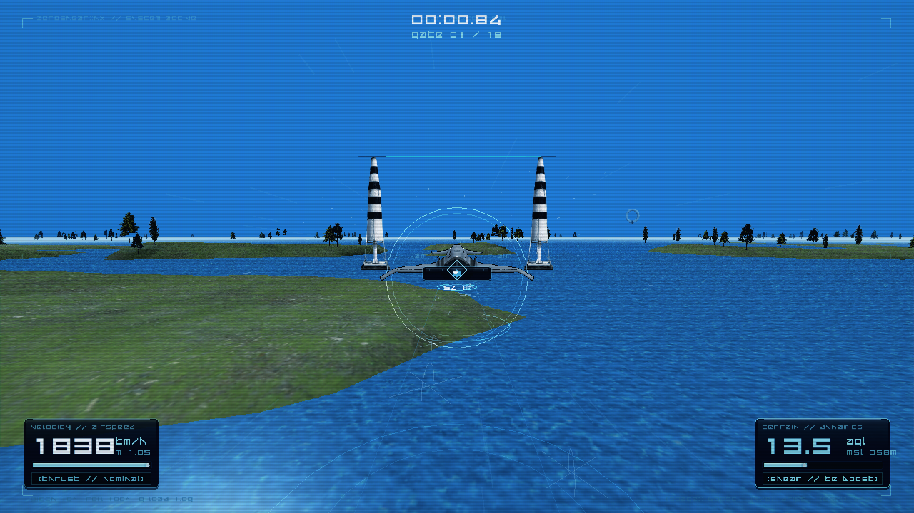
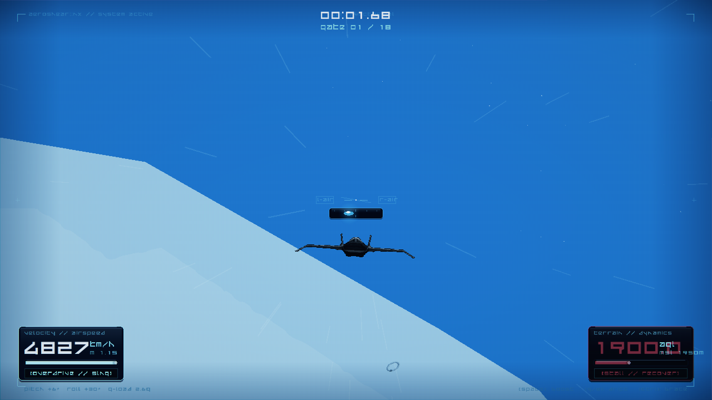

# AEROSHEAR::NX™ // PUBLIC ALPHA EDITION
### FLIGHT CORE // STANDALONE BUILD v0.1.0 // 60 FPS DETERMINISTIC ENGINE



**AEROSHEAR::NX** is a high-speed pseudo-3D / super-scaler futuristic flight racing simulator written from scratch in **pure C99** using **Raylib 5.0** and custom GLSL shaders. Heavily inspired by the golden era of 90s British racing design (*WipEout*, *The Designers Republic*, *Space Harrier*, *After Burner*), it couples strict aerodynamic simulation with pulse-pounding arcade momentum.

---

## ⚡ KEY FLIGHT SYSTEMS & FEATURES

* **Sub-8MB Standalone Footprint:** Extreme performance with zero bloat, native 60 FPS deterministic physics loop, and sub-millisecond input latency.
* **Ground-Shear Kinetic Energy (KE) System:** Flying inside the low-altitude air cushion (<18m AGL) dynamically compresses airflow, recharging Boost and Kinetic Energy for high-speed slingshots.
* **Independent Airbrakes & Centrifugal Drift:** Use individual wing airbrakes (`Q`/`E` or analog `LT`/`RT` triggers) to induce high-G drift through tight apexes without losing forward vector momentum.
* **Slingshot Gravity Dive:** Pushing the flight stick into a steep vertical dive converts gravitational potential into supersonic airspeed and dynamic compression recharge.
* **18-Checkpoint Circuit Racing:** Precision checkpoint gates (ground laser pylons and aerial rings) featuring analytical crossing planes and instant perfect-pass bonuses (+25% boost).
* **Local Save & Record Retention:** Automatic local persistence (`records.dat`) tracking best circuit times, top speeds and military pilot evaluations (*Rank S*, *Rank A*, *Rank B*) across all theaters.
* **Authentic CRT & Retro Visual Suite:** Optional CRT scanlines, aperture grille phosphor mask, chromatic aberration, power-on cathode ray beam animation, and high-G blackout/redout peripheral stress.
* **Dual Theater Selection:**
  * **DELTA STRAITS:** Coastal archipelago and braided fluvial waterways with dynamic water shader.
  * **HOT SANDS:** Vast arid desert with wind-sculpted transverse dunes and extreme heat haze.

---

## 🎮 FLIGHT CONTROLS & AVIONICS



### Keyboard Flight Bindings
| Key / Command | Tactical Action |
| :--- | :--- |
| `W` / `S` or `UP` / `DOWN` | Pitch Axis (Climb / Dive) *(Invertible in Options)* |
| `A` / `D` or `LEFT` / `RIGHT` | Roll & 360° Horizontal Heading Turn |
| `Q` / `E` | Independent Left / Right Airbrakes (Drift) |
| `SPACE` or `L-SHIFT` | Afterburner Supersonic Boost |
| `L-CTRL` or `C` | Aerodynamic Deceleration / Airbrake |
| `F11` or `ALT + ENTER` | Instant Fullscreen Toggle |
| `ESC` or `P` | Pause Tactical Flight Core |
| `R` or `SPACE` | Instant Sortie Restart (on finish) |

### Gamepad / XInput Mappings
| Gamepad Input | Tactical Action |
| :--- | :--- |
| **Left Analog Stick** | Pitch & Roll 3D Vector Flight Control |
| **LT / RT (Analog Triggers)** | Independent Left / Right Airbrakes (Drift) |
| **Button [A] / Cross** | Afterburner Supersonic Boost |
| **Button [B] / Circle** | Airbrake Deceleration |
| **Start / Menu** | Pause Tactical Flight Core |

---

## 🚀 GETTING STARTED

### Option 1: Run Precompiled Binary
1. Ensure `game.exe` is located in the same directory as `raylib.dll`, `assets/` and `shaders/`.
2. Launch `game.exe`.

### Option 2: Building from Source (MinGW-w64 GCC)
Requirements:
* GCC (MinGW-w64 C99 compiler on Windows)
* Raylib 5.0 libraries (included in `lib/` and `include/`)

Simply run:
```cmd
build.bat
```
The build script outputs an optimized `game.exe` with `-O2 -Wall -std=c99`.

---

## 📸 IN-FLIGHT TELEMETRY


*Ground-shear altitude hover run over Delta Straits waterways.*


*High-altitude kinetic dive through supersonic air-rings.*

---

## 📄 LICENSE & CREDITS
Developed by **AEROSHEAR FLIGHT OPS**.  
Built with [Raylib](https://www.raylib.com/) under the zlib/libpng license.
